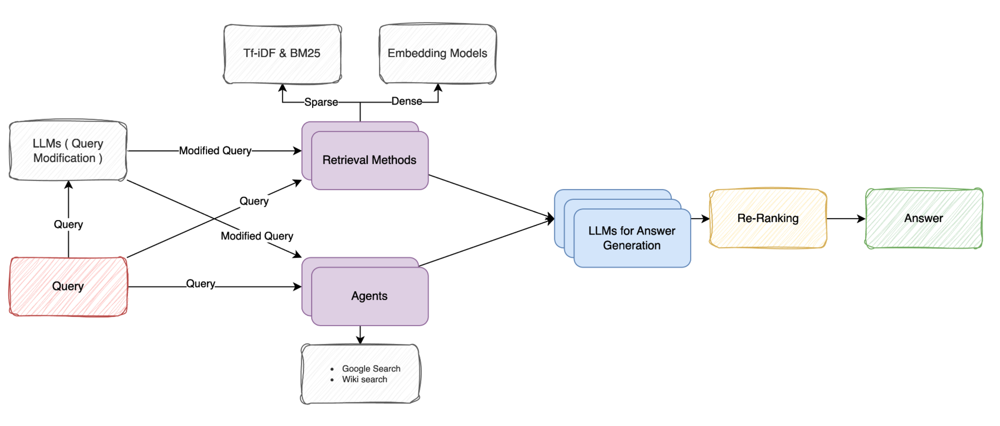

# Multi-Agent Open-Domain Question Answering with Cross-Source Reranking

## Concept Overview

### Step 1: Building Independent Open-Domain QnA Systems

We'll start by identifying a suitable QnA dataset. The dataset can include questions with or without contextual information.

Next, we'll develop three independent Open-Domain QnA systems:

* **System 1:** A Zero-Shot Question-Answering system using Llama 3.
* **System 2:** A Multi-Agent system where multiple LLMs (or a single LLM with different roles) collaborate to provide answers through multi-level reasoning.
* **System 3:** An information retrieval system where agents gather data from sources like Google and Wikipedia, using the information as context to answer the question.

### Step 2: Experimentation

We'll experiment with different combinations of these three systems to evaluate their performance and synergy.

### Step 3: Cross-Source Reranking (We expect this to perform best)

Finally, we'll train a reranker model that will analyze the outputs from these systems and select the best response, optimizing the overall accuracy and relevance of the answers provided.

