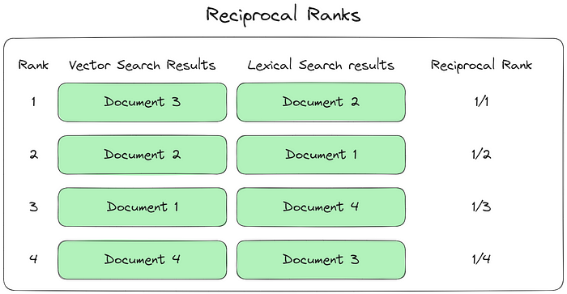
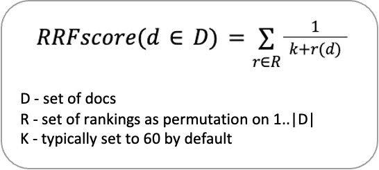

# Ranked Reciprocal Fusion (RRF)

Ranked Reciprocal Fusion (RRF) is an ensemble technique often used in information retrieval to combine the results of multiple ranking models. This repository provides an implementation of RRF, demonstrating how it can be applied to improve retrieval performance by merging the rankings from various models.

## Table of Contents
1. [Introduction](#introduction)
2. [How it Works](#how-it-works)

## Introduction
Ranked Reciprocal Fusion is a simple yet effective method for combining rankings from different retrieval models. Each model's ranking contributes to the final score based on the rank of the items in the individual lists, giving more weight to higher-ranked items.

This repository provides a Python implementation and examples of RRF in action.

## How it Works
In RRF, the score of an item is calculated as:

<!-- \[
\text{RRF Score} = \sum \frac{1}{k + r}
\]-->

where:
- \(k\) is a constant (typically 60).
- \(r\) is the rank of the item in each individual ranking.

The resulting scores are combined, and the final ranking is based on the total RRF score.

